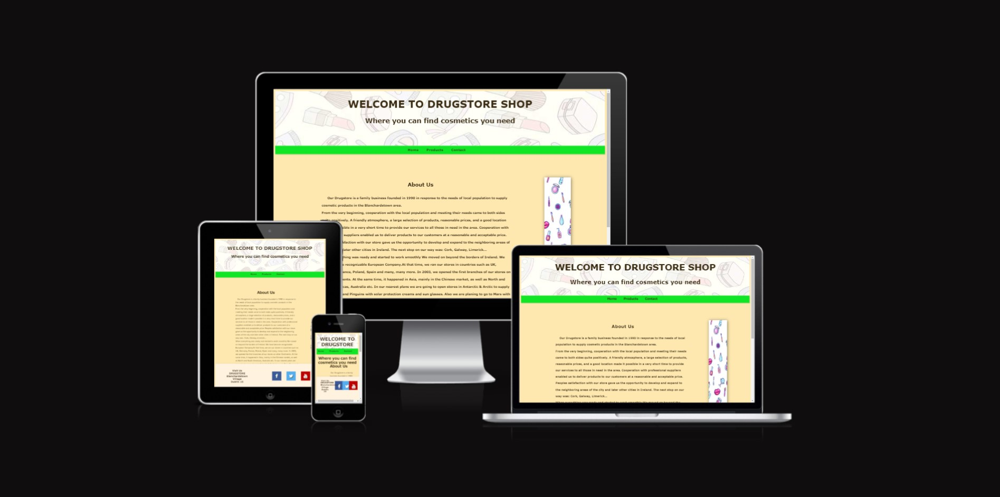
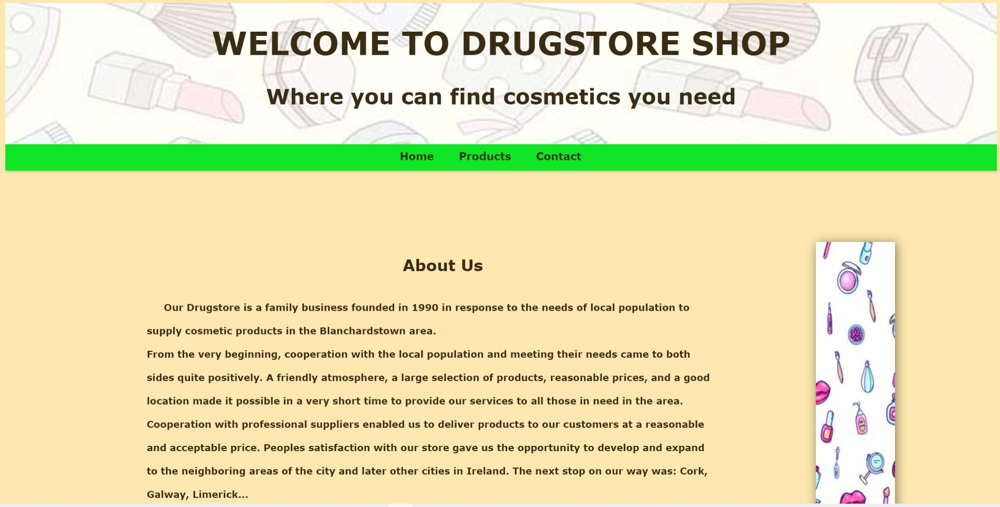
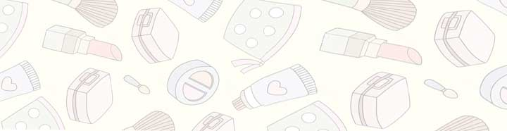
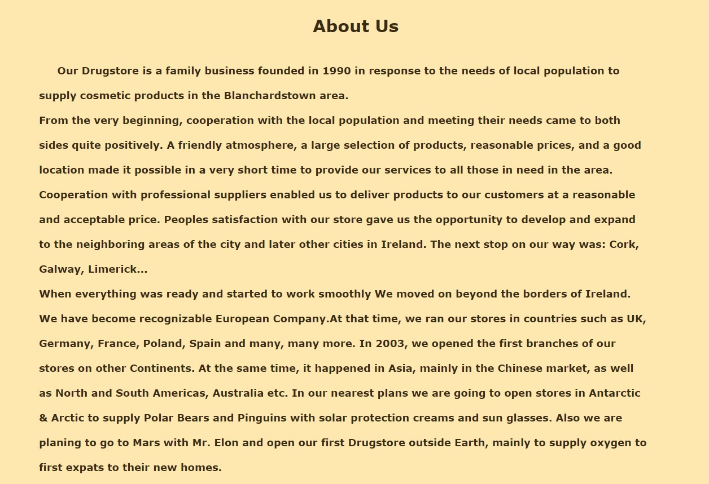
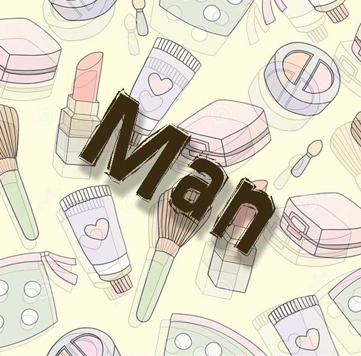
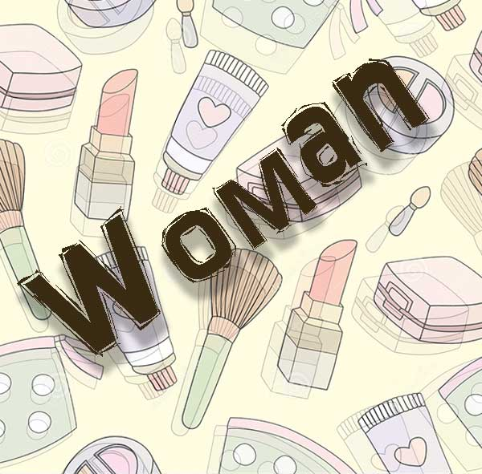
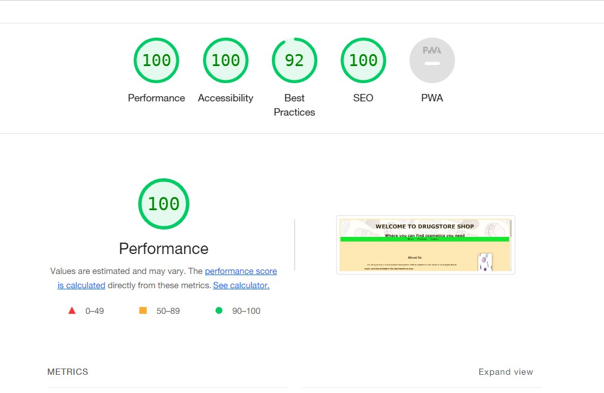
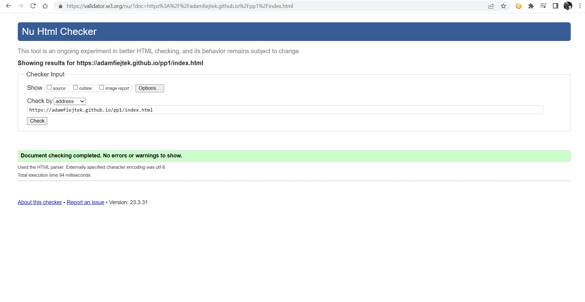

# Drugstore Cosmetics

<https://adamfiejtek.github.io/drug-store-online/index.html>

Portfolio Project 1

# Author

Adam Fiejtek

# Project Overview

Drugstore is online e-commerce website which is designed to sale cosmetic products in fast, convenient, reliable manner.
Bright theme with dark font color make the website easy to read.

## Features

- Sticky nav bar after scrolling to the top of the page.
- Contact form.
- Thank you page after succesful submission of contact form.
- Responcive design for devices like tablet and mobile phone.
- Favicon.
- Footer with address paragraph and 3 link icons provided by:
	<https://cdnjs.cloudflare.com/ajax/libs/font-awesome/4.7.0/css/font-awesome.min.css>

### Header

Includes Header image and also h1 and p text.

### Navigation Bar

Included in every page. Includes links to Home, Products, Contact and Thank you pages. Easy to navigate throught all website.

### About us section

Providing information about history , purpose and goals of the company.

### Typography

'font-family: Montserrat, Verdana, sans-serif;'

### Colors

Font color:

'color: rgb(58, 43, 19);'
'black on a:hover'
'#3A2B13;'

Bacground color:

'#FEE8B0'

Navigation bar color:

'rgb(17, 230, 38)'

### Images

 

### Animations

The only animations used here are box shadow and color change while hovering over link text.

### Validation Testing

- [CSS Validator](https://jigsaw.w3.org/css-validator/)
- [HTML Validator](https://validator.w3.org/)
	
	

### Accessibility test

Made by Lighthouse Chrome broswer plugin

	

### Deployment

Website deployed to GitHub pp1 repository.
<https://adamfiejtek.github.io/pp1/index.html>

## Credits

- <https://www.w3schools.com/> - Contact form inspiration / code troubleshooting.
- <https://cdnjs.cloudflare.com/ajax/libs/font-awesome/4.7.0/css/font-awesome.min.css> - social media footer icons.
- <https://stackoverflow.com/> - code troubleshooting.
- <https://www.vectorstock.com/> - images used in project thanks to vector stock.
- <https://redketchup.io/favicon-generator> - favicon generator.

### Acknowledgment

- <https://validator.w3.org/> - HTML validator
- <https://jigsaw.w3.org/> - CSS validator
- <https://codeinstitute.ne> - Thank you.
